# Smart Waste - System Architecture

## Complete Architecture Documentation

**Author:** Ernur Torekul
**Project:** Intelligent Household Waste Classification System
**Document Version:** 1.0
**Last Updated:** 2026-04-08

---

## Table of Contents

1. [Architecture Overview](#1-architecture-overview)
2. [High-Level System Architecture](#2-high-level-system-architecture)
3. [Component Architecture](#3-component-architecture)
4. [Data Flow Architecture](#4-data-flow-architecture)
5. [Backend Architecture](#5-backend-architecture)
6. [Frontend Architecture](#6-frontend-architecture)
7. [Database Architecture](#7-database-architecture)
8. [Security Architecture](#8-security-architecture)
9. [Integration Architecture](#9-integration-architecture)
10. [Deployment Architecture](#10-deployment-architecture)
11. [Scalability Architecture](#11-scalability-architecture)
12. [Technology Rationale](#12-technology-rationale)

---

## 1. Architecture Overview

### 1.1 Architectural Style

The Smart Waste system implements a **Three-Tier Architecture** with microservices characteristics:

```
┌─────────────────────────────────────────────────────────────────────┐
│                        PRESENTATION LAYER                           │
│  (Mobile PWA + Admin Dashboard)                                     │
└─────────────────────────────┬───────────────────────────────────────┘
                              │ HTTPS/WSS
                              ▼
┌─────────────────────────────────────────────────────────────────────┐
│                         APPLICATION LAYER                           │
│  (NestJS REST API + Business Logic)                                │
└─────────────────────────────┬───────────────────────────────────────┘
                              │ SQL/HTTP
                              ▼
┌─────────────────────────────────────────────────────────────────────┐
│                          DATA LAYER                                 │
│  (PostgreSQL + Cloudinary + OpenAI)                                │
└─────────────────────────────────────────────────────────────────────┘
```

### 1.2 Architectural Principles

| Principle | Implementation |
|-----------|----------------|
| **Separation of Concerns** | Each layer handles specific responsibilities |
| **Loose Coupling** | Services communicate through well-defined interfaces |
| **High Cohesion** | Related functionality grouped in modules |
| **SOLID Principles** | Applied throughout the codebase |
| **DRY (Don't Repeat Yourself)** | Shared utilities and common modules |
| **API-First Design** | RESTful API as primary integration point |

### 1.3 Design Patterns Used

1. **Dependency Injection** - NestJS built-in DI container
2. **Repository Pattern** - Data access abstraction via Prisma
3. **Factory Pattern** - AI provider selection (OpenAI/Ollama)
4. **Observer Pattern** - Notification system for bin status changes
5. **Strategy Pattern** - Multiple notification strategies (Telegram, Email)
6. **Middleware Pattern** - Request/response transformation pipeline

---

## 2. High-Level System Architecture

### 2.1 Complete System Diagram

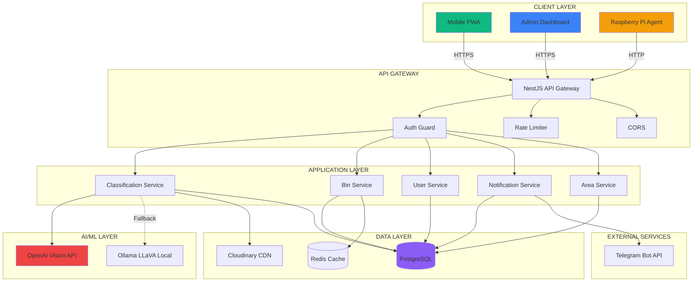

### 2.2 Layer Responsibilities

**Presentation Layer:**
- User interface rendering
- Client-side validation
- API communication
- State management
- Progressive Web App capabilities

**Application Layer:**
- Business logic implementation
- Request validation
- Authentication/authorization
- External service integration
- Response formatting

**Data Layer:**
- Data persistence
- Caching
- Transaction management
- Data integrity enforcement

---

## 3. Component Architecture

### 3.1 Backend Component Diagram

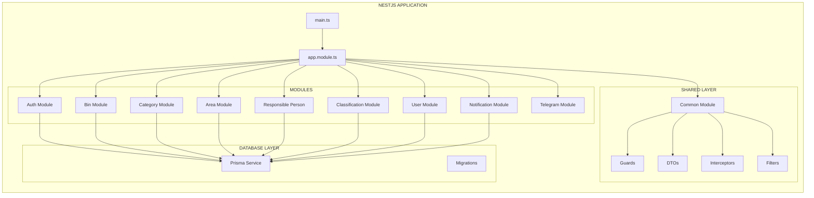

### 3.2 Frontend Component Diagram

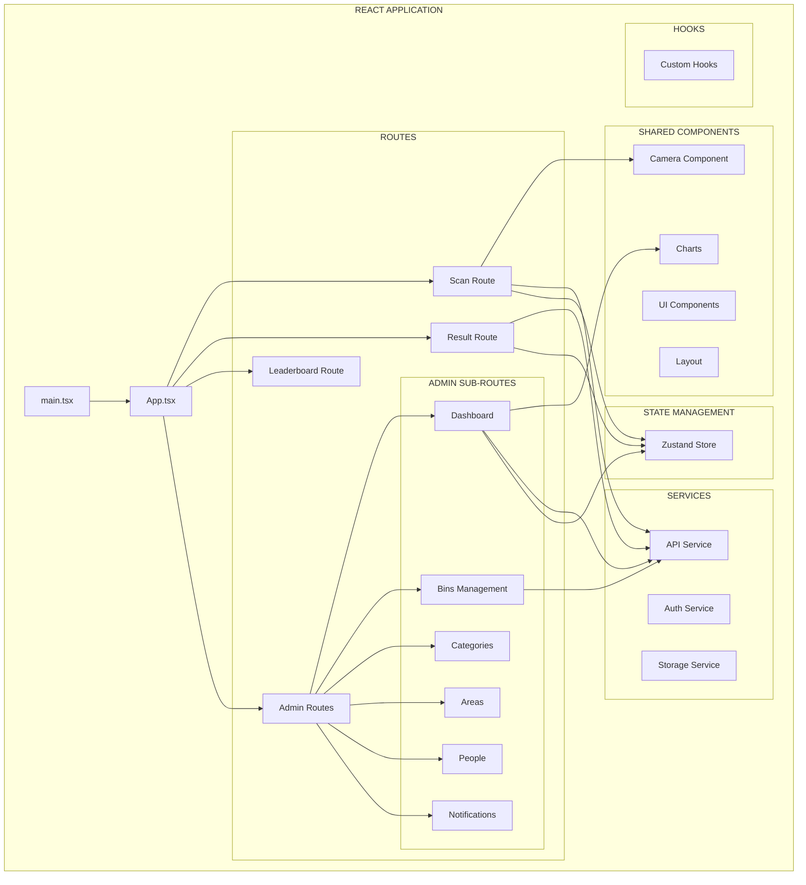

---

## 4. Data Flow Architecture

### 4.1 User Classification Flow

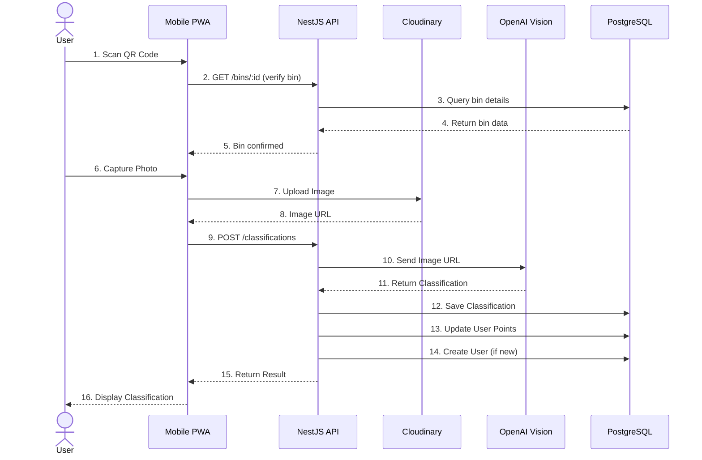

### 4.2 Bin Fullness Notification Flow

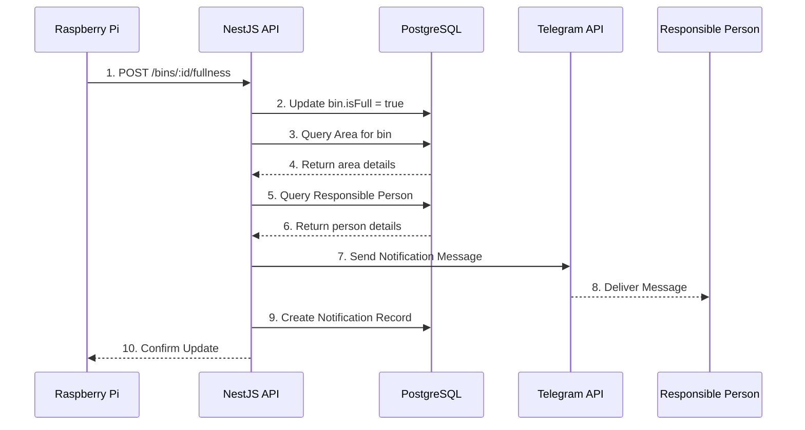

### 4.3 Admin Authentication Flow

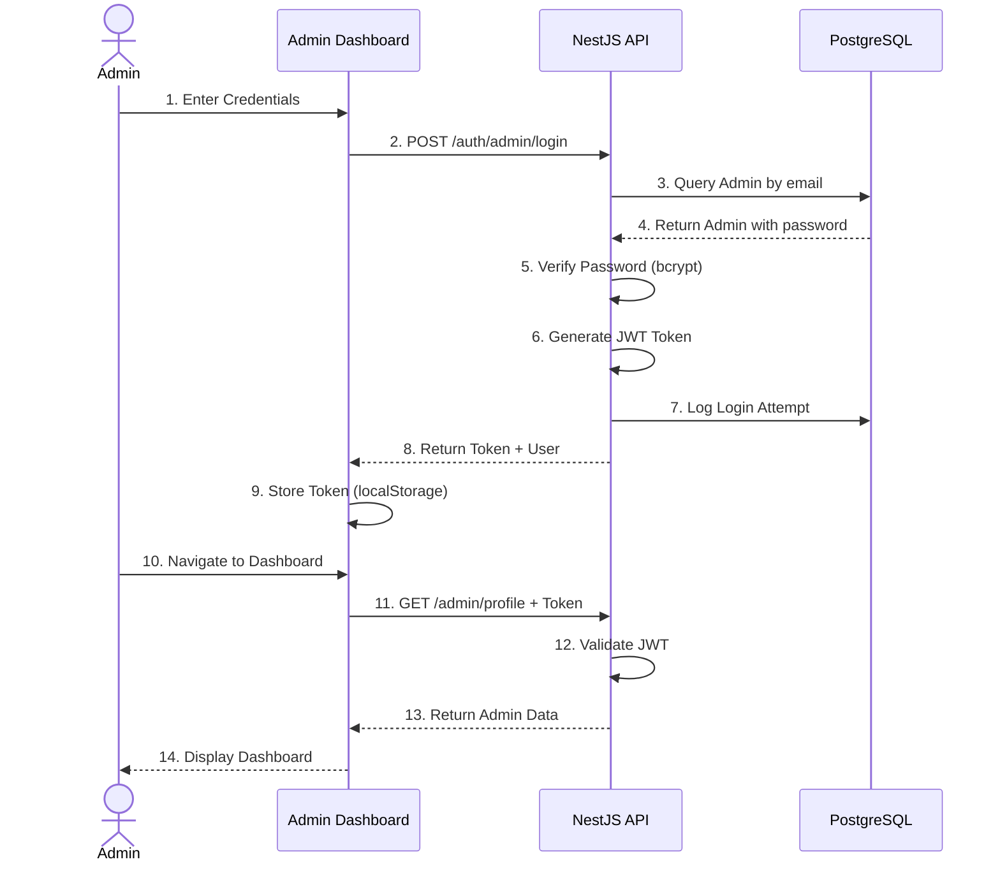

---

## 5. Backend Architecture

### 5.1 NestJS Module Structure

```
apps/api/src
├── main.ts                      # Application entry point
├── app.module.ts                # Root module
├── app.controller.ts            # Root controller
├── app.service.ts               # Root service
│
├── config/                      # Configuration files
│   ├── configuration.ts         # Type-safe config
│   ├── database.config.ts       # Database configuration
│   ├── openai.config.ts         # OpenAI configuration
│   └── telegram.config.ts       # Telegram configuration
│
├── common/                      # Shared modules
│   ├── common.module.ts
│   ├── decorators/              # Custom decorators
│   │   ├── current-user.decorator.ts
│   │   └── roles.decorator.ts
│   ├── filters/                 # Exception filters
│   │   └── http-exception.filter.ts
│   ├── guards/                  # Auth guards
│   │   ├── jwt-auth.guard.ts
│   │   └── roles.guard.ts
│   ├── interceptors/            # Response interceptors
│   │   └── transform.interceptor.ts
│   ├── pipes/                   # Validation pipes
│   │   └── validation.pipe.ts
│   └── dto/                     # Common DTOs
│       └── response.dto.ts
│
├── auth/                        # Authentication module
│   ├── auth.module.ts
│   ├── auth.controller.ts
│   ├── auth.service.ts
│   ├── dto/
│   │   ├── login.dto.ts
│   │   └── register.dto.ts
│   └── strategies/
│       └── jwt.strategy.ts
│
├── users/                       # Users module
│   ├── users.module.ts
│   ├── users.controller.ts
│   ├── users.service.ts
│   └── dto/
│       ├── create-user.dto.ts
│       └── update-user.dto.ts
│
├── bins/                        # Bins module
│   ├── bins.module.ts
│   ├── bins.controller.ts
│   ├── bins.service.ts
│   └── dto/
│       ├── create-bin.dto.ts
│       ├── update-bin.dto.ts
│       └── bin-fullness.dto.ts
│
├── bin-categories/              # Bin categories module
│   ├── bin-categories.module.ts
│   ├── bin-categories.controller.ts
│   ├── bin-categories.service.ts
│   └── dto/
│       ├── create-category.dto.ts
│       └── update-category.dto.ts
│
├── areas/                       # Areas module
│   ├── areas.module.ts
│   ├── areas.controller.ts
│   ├── areas.service.ts
│   └── dto/
│       ├── create-area.dto.ts
│       └── update-area.dto.ts
│
├── responsible-persons/         # Responsible persons module
│   ├── responsible-persons.module.ts
│   ├── responsible-persons.controller.ts
│   ├── responsible-persons.service.ts
│   └── dto/
│       ├── create-person.dto.ts
│       └── update-person.dto.ts
│
├── classifications/             # Classifications module
│   ├── classifications.module.ts
│   ├── classifications.controller.ts
│   ├── classifications.service.ts
│   └── dto/
│       ├── create-classification.dto.ts
│       └── classification-response.dto.ts
│
├── notifications/               # Notifications module
│   ├── notifications.module.ts
│   ├── notifications.controller.ts
│   ├── notifications.service.ts
│   └── dto/
│       └── notification.dto.ts
│
├── telegram/                    # Telegram module
│   ├── telegram.module.ts
│   ├── telegram.service.ts
│   └── dto/
│       └── send-message.dto.ts
│
├── ai/                          # AI/ML module
│   ├── ai.module.ts
│   ├── ai.service.ts
│   ├── providers/
│   │   ├── openai.provider.ts
│   │   └── ollama.provider.ts
│   └── dto/
│       └── classify-request.dto.ts
│
└── prisma/                      # Prisma ORM
    ├── prisma.service.ts        # Prisma service
    └── prisma.module.ts
```

### 5.2 Service Layer Architecture

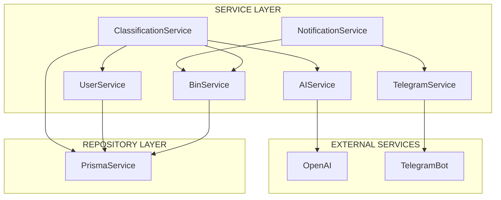

### 5.3 Dependency Injection Flow

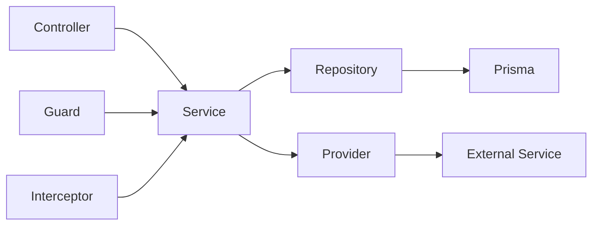

---

## 6. Frontend Architecture

### 6.1 React Application Structure

```
apps/web/src
├── main.tsx                     # Application entry point
├── App.tsx                      # Root component
├── index.css                    # Global styles
├── vite-env.d.ts                # Vite type declarations
│
├── pages/                       # Route pages
│   ├── ScanPage.tsx             # QR scan landing
│   ├── ResultPage.tsx           # Classification result
│   ├── LeaderboardPage.tsx      # Eco-points leaderboard
│   └── admin/
│       ├── AdminLayout.tsx      # Admin shell
│       ├── DashboardPage.tsx    # Admin dashboard
│       ├── BinsPage.tsx         # Bin management
│       ├── CategoriesPage.tsx   # Category management
│       ├── AreasPage.tsx        # Area management
│       ├── PeoplePage.tsx       # People management
│       ├── NotificationsPage.tsx # Notification history
│       └── LoginPage.tsx        # Admin login
│
├── components/                  # Reusable components
│   ├── ui/                      # Base UI components
│   │   ├── Button.tsx
│   │   ├── Input.tsx
│   │   ├── Card.tsx
│   │   ├── Modal.tsx
│   │   ├── Table.tsx
│   │   └── Badge.tsx
│   ├── camera/                  # Camera components
│   │   ├── CameraView.tsx       # Camera capture
│   │   └── ImagePreview.tsx     # Image preview
│   ├── layout/                  # Layout components
│   │   ├── Header.tsx
│   │   ├── Sidebar.tsx
│   │   └── Footer.tsx
│   └── charts/                  # Chart components
│       ├── BarChart.tsx
│       ├── PieChart.tsx
│       └── LineChart.tsx
│
├── hooks/                       # Custom React hooks
│   ├── useCamera.ts             # Camera access
│   ├── useClassification.ts     # Classification logic
│   ├── useAuth.ts               # Authentication
│   ├── useLocalStorage.ts       # Local storage wrapper
│   └── useDebounce.ts           # Debounce utility
│
├── services/                    # API services
│   ├── api.ts                   # Axios configuration
│   ├── auth.service.ts          # Auth endpoints
│   ├── bin.service.ts           # Bin endpoints
│   ├── classification.service.ts # Classification endpoints
│   ├── user.service.ts          # User endpoints
│   └── notification.service.ts  # Notification endpoints
│
├── store/                       # State management
│   ├── index.ts                 # Store configuration
│   ├── auth.store.ts            # Auth state
│   ├── bin.store.ts             # Bin state
│   └── user.store.ts            # User state
│
├── types/                       # TypeScript types
│   ├── api.types.ts             # API response types
│   ├── bin.types.ts             # Bin types
│   ├── user.types.ts            # User types
│   └── classification.types.ts  # Classification types
│
├── utils/                       # Utility functions
│   ├── validation.ts            # Input validation
│   ├── format.ts                # Formatting utilities
│   └── constants.ts             # App constants
│
└── assets/                      # Static assets
    ├── images/
    ├── icons/
    └── fonts/
```

### 6.2 State Management Architecture

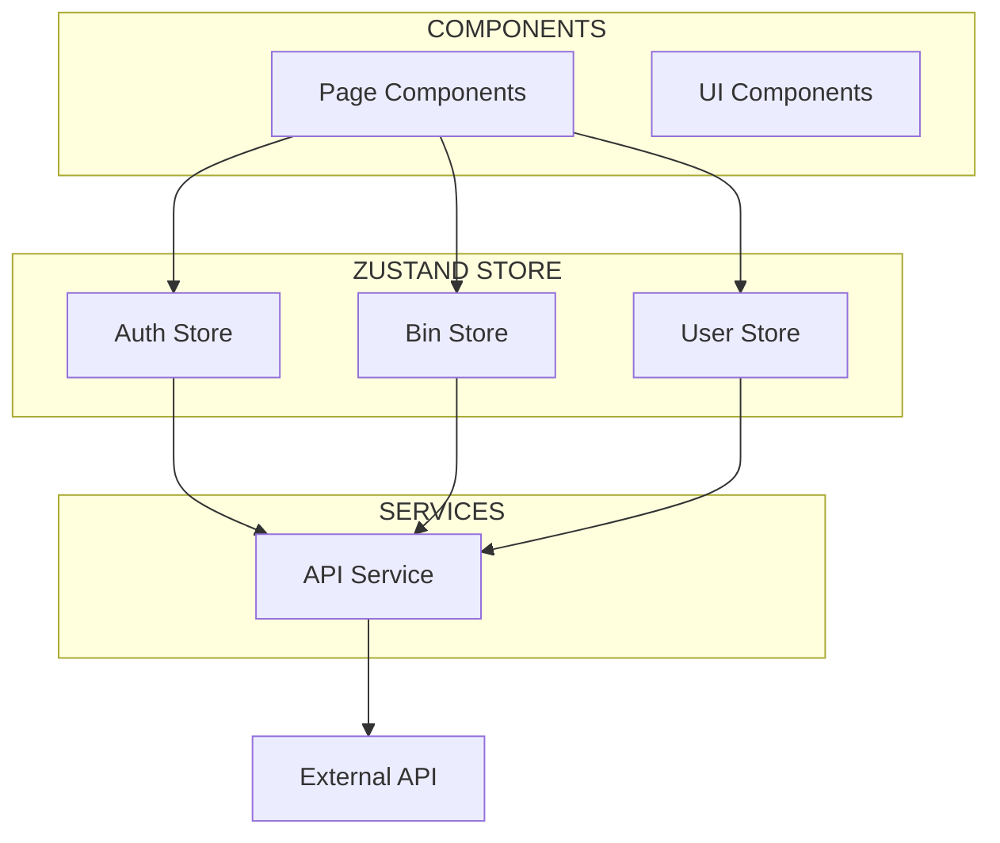

### 6.3 Component Communication

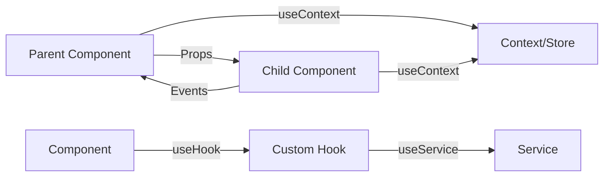

---

## 7. Database Architecture

### 7.1 PostgreSQL Schema

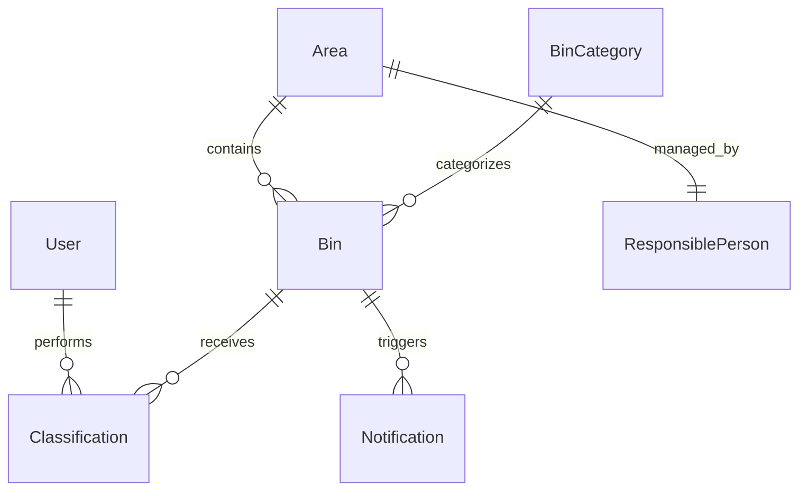

### 7.2 Connection Pooling

```typescript
// Prisma configuration for optimal connection management
datasource db {
  provider = "postgresql"
  url      = env("DATABASE_URL")

  // Connection pool settings
  pool_timeout = 30
  connection_limit = 10
}
```

### 7.3 Transaction Management

```typescript
// Example transaction for classification
async function createClassification(data: ClassificationDto) {
  return await prisma.$transaction(async (tx) => {
    // Create classification
    const classification = await tx.classification.create({ data });

    // Update user points
    await tx.user.update({
      where: { id: data.userId },
      data: { ecoPoints: { increment: 10 } }
    });

    return classification;
  });
}
```

---

## 8. Security Architecture

### 8.1 Authentication Flow

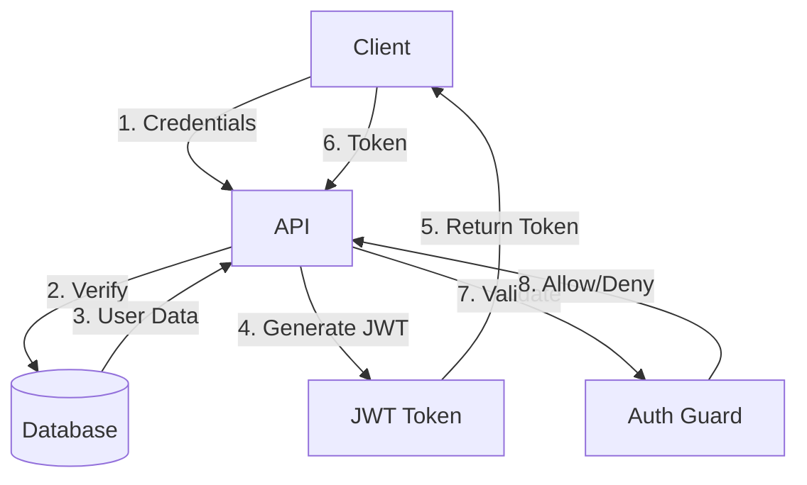

### 8.2 Authorization Layers

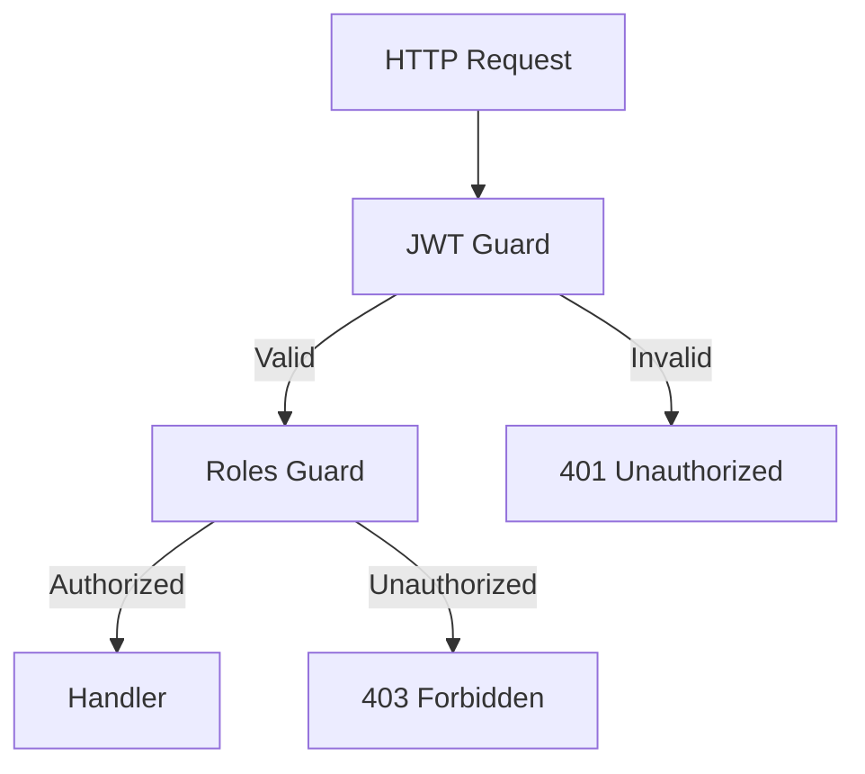

### 8.3 Security Headers

```typescript
// Helmet.js security headers
app.use(helmet({
  contentSecurityPolicy: {
    directives: {
      defaultSrc: ["'self'"],
      styleSrc: ["'self'", "'unsafe-inline'"],
      scriptSrc: ["'self'"],
      imgSrc: ["'self'", "res.cloudinary.com"],
      connectSrc: ["'self'"],
    }
  },
  hsts: {
    maxAge: 31536000,
    includeSubDomains: true,
  }
}));
```

---

## 9. Integration Architecture

### 9.1 External Service Integrations

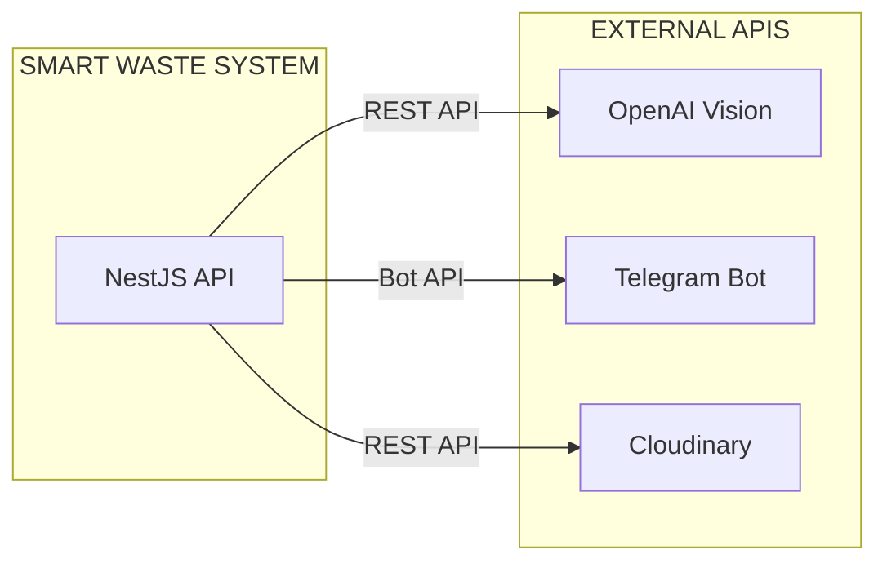

### 9.2 API Integration Pattern

```typescript
// Service abstraction for external APIs
interface AIProvider {
  classify(imageUrl: string): Promise<ClassificationResult>;
}

class OpenAIProvider implements AIProvider {
  async classify(imageUrl: string): Promise<ClassificationResult> {
    // OpenAI-specific implementation
  }
}

class OllamaProvider implements AIProvider {
  async classify(imageUrl: string): Promise<ClassificationResult> {
    // Ollama-specific implementation
  }
}
```

---

## 10. Deployment Architecture

### 10.1 Production Deployment

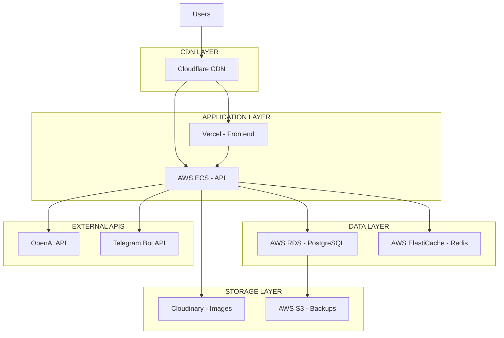

### 10.2 Infrastructure Stack

| Component | Service | Purpose |
|-----------|---------|---------|
| **Frontend** | Vercel | React app hosting with CDN |
| **Backend** | AWS ECS | Container orchestration |
| **Database** | AWS RDS | Managed PostgreSQL |
| **Cache** | AWS ElastiCache | Redis caching layer |
| **Storage** | Cloudinary | Image CDN and processing |
| **DNS** | Cloudflare | DNS management and DDoS protection |
| **Monitoring** | Sentry | Error tracking and performance |
| **CI/CD** | GitHub Actions | Automated deployment pipeline |

---

## 11. Scalability Architecture

### 11.1 Horizontal Scaling

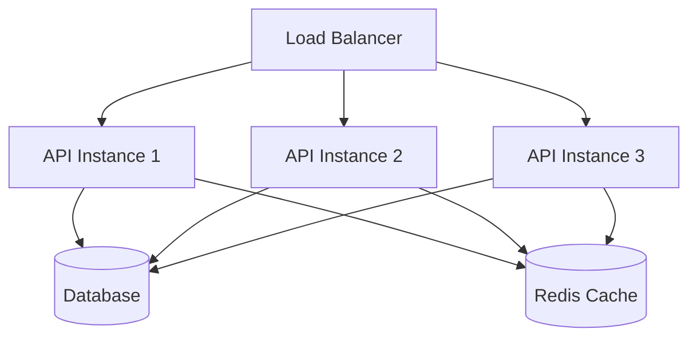

### 11.2 Scaling Strategy

| Component | Scaling Type | Strategy |
|-----------|--------------|----------|
| **API** | Horizontal | Auto-scaling based on CPU/memory |
| **Database** | Vertical | Increase instance size |
| **Database** | Horizontal | Read replicas for analytics |
| **Cache** | Horizontal | Redis Cluster |
| **Storage** | Built-in | Cloudinary auto-scales |

### 11.3 Performance Optimization

**Caching Strategy:**
```typescript
// Redis caching implementation
async function getBin(id: string) {
  const cached = await redis.get(`bin:${id}`);
  if (cached) return JSON.parse(cached);

  const bin = await prisma.bin.findUnique({ where: { id } });
  await redis.setex(`bin:${id}`, 3600, JSON.stringify(bin));

  return bin;
}
```

**Query Optimization:**
```typescript
// Efficient query with select
const bins = await prisma.bin.findMany({
  select: {
    id: true,
    location: true,
    isFull: true,
    category: { select: { name: true, color: true } }
  }
});
```

---

## 12. Technology Rationale

### 12.1 Backend Technology Choices

| Technology | Justification |
|------------|---------------|
| **NestJS** | Structured architecture, TypeScript support, dependency injection, enterprise-ready patterns |
| **Prisma** | Type-safe database access, excellent TypeScript integration, automated migrations |
| **PostgreSQL** | ACID compliance, advanced features, proven scalability, open source |
| **JWT** | Stateless authentication, industry standard, mobile-friendly |
| **OpenAI Vision** | Highest accuracy, reliable API, fast response times |

### 12.2 Frontend Technology Choices

| Technology | Justification |
|------------|---------------|
| **React 18** | Component-based architecture, large ecosystem, concurrent features |
| **Vite** | Fast development server, optimized builds, modern tooling |
| **TailwindCSS** | Rapid UI development, consistent design system, small bundle size |
| **Zustand** | Simple state management, TypeScript support, minimal boilerplate |
| **PWA** | Mobile-first approach, offline support, installable |

### 12.3 Infrastructure Technology Choices

| Technology | Justification |
|------------|---------------|
| **Vercel** | Zero-config deployment, global CDN, automatic HTTPS, preview deployments |
| **AWS ECS** | Container orchestration, auto-scaling, integration with AWS services |
| **Cloudinary** | Image optimization, global CDN, transformation APIs, generous free tier |
| **Redis** | Fast in-memory caching, session storage, rate limiting support |

---

## Architecture Decision Records (ADR)

### ADR-001: REST API vs GraphQL

**Decision:** Use REST API

**Rationale:**
- Simpler to implement and debug
- Better caching with HTTP headers
- Wider adoption and tooling
- Sufficient for our use case

### ADR-002: Monorepo vs Separate Repositories

**Decision:** Monorepo with simple folder structure

**Rationale:**
- Shared code and types
- Simplified development workflow
- Easier for single developer
- Atomic commits across frontend/backend

### ADR-003: OpenAI vs Custom Model

**Decision:** OpenAI Vision API (primary)

**Rationale:**
- Higher accuracy out of the box
- No model training required
- Continuous improvements by OpenAI
- Ollama as documented fallback

### ADR-004: PostgreSQL vs MongoDB

**Decision:** PostgreSQL

**Rationale:**
- Relational data fits our schema
- ACID compliance for transactions
- Advanced query capabilities
- Better for analytics and reporting

---

## Architecture Compliance

### Standards Compliance

| Standard | Compliance | Notes |
|----------|------------|-------|
| **REST API** | ✅ Full | Richardson Maturity Model Level 3 |
| **OpenAPI** | ⚠️ Partial | Can be added with Swagger |
| **GDPR** | ✅ Full | Right to deletion, data export |
| **WCAG 2.1** | ⚠️ Partial | AA compliance target |
| **OWASP** | ✅ Full | Security best practices applied |

### Code Quality Standards

| Practice | Implementation |
|----------|----------------|
| **Linting** | ESLint + Prettier |
| **Type Safety** | Strict TypeScript |
| **Testing** | Jest + Supertest + Playwright |
| **Git Hooks** | Husky for pre-commit checks |
| **Code Reviews** | Self-review checklist |

---

## Future Architecture Considerations

### Potential Upgrades

1. **Microservices Transition:** Split into separate services if scale demands
2. **Event-Driven Architecture:** Add message queue (RabbitMQ/Kafka)
3. **Real-time Updates:** WebSocket integration for live bin status
4. **Multi-region Deployment:** Geographic distribution for latency
5. **Edge Computing:** Lambda@Edge for request processing

### Architecture Debt

1. **Add API Gateway:** Kong or AWS API Gateway for advanced routing
2. **Implement Circuit Breaker:** For external service calls
3. **Add Distributed Tracing:** OpenTelemetry for debugging
4. **Implement Rate Limiting:** Per-user and per-API limits
5. **Add API Versioning:** v1, v2 endpoints for backward compatibility

---

**Document Version:** 1.0
**Last Updated:** 2026-04-08
**Author:** Ernur Torekul
**Status:** Complete Architecture Documentation
