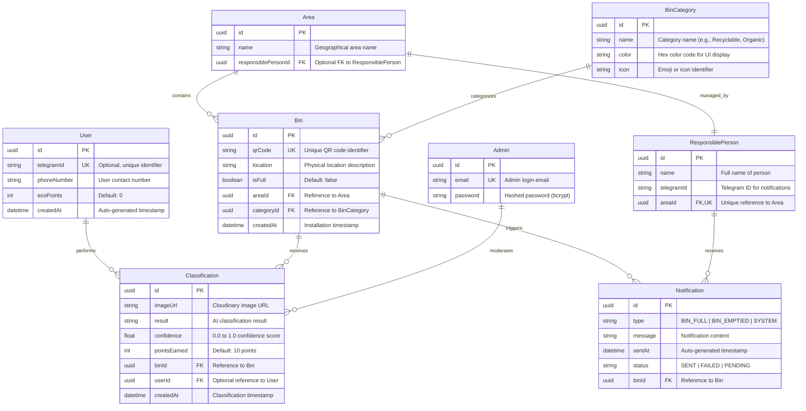

# Smart Waste - Entity Relationship Diagram

## Complete ER Diagram



---

## Entity Relationship Legend

| Symbol | Meaning |
|--------|---------|
| `||--||` | One-to-One (1:1) |
| `||--o{` | One-to-Many (1:N) |
| `||--|{` | One-to-Many (Mandatory) |
| `}o--o{` | Many-to-Many (N:M) |

---

## Detailed Entity Descriptions

### 1. User

| Attribute | Type | Constraints | Description |
|-----------|------|-------------|-------------|
| **id** | UUID | PRIMARY KEY | Unique system identifier |
| **telegramId** | String(255) | UNIQUE, NULLABLE | Telegram user ID for identification and leaderboards |
| **phoneNumber** | String(50) | NULLABLE | User contact number for notifications |
| **ecoPoints** | Integer | DEFAULT: 0 | Accumulated eco-points from classifications |
| **createdAt** | DateTime | AUTO | Account creation timestamp |

**Relationships:**
- One user can perform zero or more classifications (1:N)
- A classification can be performed by zero or one user (optional)

**Business Rules:**
- Users can remain anonymous (no telegramId required)
- Eco-points are awarded per successful classification (+10 default)
- Telegram ID must be unique when provided

---

### 2. Area

| Attribute | Type | Constraints | Description |
|-----------|------|-------------|-------------|
| **id** | UUID | PRIMARY KEY | Unique system identifier |
| **name** | String(255) | NOT NULL | Geographical area name/description |
| **responsiblePersonId** | UUID | FOREIGN KEY, NULLABLE | Assigned person responsible for this area |

**Relationships:**
- One area can contain zero or more bins (1:N)
- One area is managed by zero or one responsible person (1:1, optional)

**Business Rules:**
- Areas represent geographical zones (districts, neighborhoods)
- Each area can have at most one responsible person
- Areas without responsible persons exist in pending assignment state

---

### 3. ResponsiblePerson

| Attribute | Type | Constraints | Description |
|-----------|------|-------------|-------------|
| **id** | UUID | PRIMARY KEY | Unique system identifier |
| **name** | String(255) | NOT NULL | Full name of the responsible person |
| **telegramId** | String(255) | NOT NULL | Telegram username/ID for receiving notifications |
| **areaId** | UUID | FOREIGN KEY, UNIQUE | Area managed by this person |

**Relationships:**
- One responsible person manages exactly one area (1:1)
- One responsible person can receive zero or more notifications (1:N)

**Business Rules:**
- Telegram ID is required for notification delivery
- One person can only manage one area (exclusive assignment)
- Removing a person leaves the area without management

---

### 4. BinCategory

| Attribute | Type | Constraints | Description |
|-----------|------|-------------|-------------|
| **id** | UUID | PRIMARY KEY | Unique system identifier |
| **name** | String(255) | NOT NULL | Category name (e.g., Recyclable, General, Organic) |
| **color** | String(7) | NOT NULL | Hex color code (e.g., #10B981) |
| **icon** | String(50) | NOT NULL | Emoji or icon identifier |

**Relationships:**
- One category can be assigned to zero or more bins (1:N)

**Business Rules:**
- Categories define the types of waste bins in the system
- Default categories: Recyclable, General Trash, Organic, Hazardous
- Categories cannot be deleted if bins are assigned (referential integrity)

---

### 5. Bin

| Attribute | Type | Constraints | Description |
|-----------|------|-------------|-------------|
| **id** | UUID | PRIMARY KEY | Unique system identifier |
| **qrCode** | String(255) | UNIQUE, NOT NULL | Unique QR code identifier |
| **location** | Text | NOT NULL | Physical location description |
| **isFull** | Boolean | DEFAULT: false | Current fullness status |
| **areaId** | UUID | FOREIGN KEY | Area containing this bin |
| **categoryId** | UUID | FOREIGN KEY | Waste category of this bin |
| **createdAt** | DateTime | AUTO | Installation timestamp |

**Relationships:**
- One bin belongs to exactly one area (N:1)
- One bin is categorized by exactly one category (N:1)
- One bin can receive zero or more classifications (1:N)
- One bin can trigger zero or more notifications (1:N)

**Business Rules:**
- QR codes must be globally unique
- Physical bins display QR codes for users to scan
- Fullness status is updated by Pi agents or manual override
- Location should be descriptive for collection personnel

---

### 6. Classification

| Attribute | Type | Constraints | Description |
|-----------|------|-------------|-------------|
| **id** | UUID | PRIMARY KEY | Unique system identifier |
| **imageUrl** | String(500) | NOT NULL | Cloudinary CDN URL |
| **result** | String(255) | NOT NULL | AI-identified waste category |
| **confidence** | Float | NOT NULL | AI confidence score (0.0-1.0) |
| **pointsEarned** | Integer | DEFAULT: 10 | Points awarded to user |
| **binId** | UUID | FOREIGN KEY | Bin where classification occurred |
| **userId** | UUID | FOREIGN KEY, NULLABLE | User who performed scan |
| **createdAt** | DateTime | AUTO | Classification timestamp |

**Relationships:**
- One classification belongs to exactly one bin (N:1)
- One classification is performed by zero or one user (N:1, optional)

**Business Rules:**
- Image URL must be publicly accessible for AI processing
- Confidence score below threshold may trigger manual review
- Points are awarded regardless of user registration
- Classifications are immutable (audit trail)

---

### 7. Notification

| Attribute | Type | Constraints | Description |
|-----------|------|-------------|-------------|
| **id** | UUID | PRIMARY KEY | Unique system identifier |
| **type** | String(50) | NOT NULL | Notification type enum |
| **message** | Text | NOT NULL | Notification content |
| **sentAt** | DateTime | AUTO | Timestamp when sent |
| **status** | String(20) | DEFAULT: "SENT" | Delivery status |
| **binId** | UUID | FOREIGN KEY | Related bin for notification |

**Relationships:**
- One notification is associated with exactly one bin (N:1)

**Business Rules:**
- Notification types: BIN_FULL, BIN_EMPTIED, SYSTEM_ALERT
- Failed notifications can be retried via admin dashboard
- Notifications serve as audit trail for communication

---

### 8. Admin

| Attribute | Type | Constraints | Description |
|-----------|------|-------------|-------------|
| **id** | UUID | PRIMARY KEY | Unique system identifier |
| **email** | String(255) | UNIQUE, NOT NULL | Login email address |
| **password** | String(255) | NOT NULL | Bcrypt hashed password |

**Relationships:**
- Admins have direct database access (no explicit relationships)

**Business Rules:**
- Passwords are hashed with bcrypt (10 salt rounds)
- Admin accounts are created via database seed or CLI
- JWT tokens are issued for authentication (24h expiration)

---

## Relationship Constraints

### One-to-One Relationships

| Entity A | Cardinality | Entity B | Description |
|----------|-------------|----------|-------------|
| Area | 1:1 | ResponsiblePerson | Each area has at most one responsible person |

### One-to-Many Relationships

| Parent Entity | Cardinality | Child Entity | Description |
|---------------|-------------|--------------|-------------|
| User | 1:N | Classification | One user can perform multiple classifications |
| Area | 1:N | Bin | One area contains multiple bins |
| BinCategory | 1:N | Bin | One category applies to multiple bins |
| Bin | 1:N | Classification | One bin receives multiple classifications |
| Bin | 1:N | Notification | One bin triggers multiple notifications |

---

## Database Constraints

### Primary Keys (PK)
- All entities use UUID as primary key for distributed system compatibility
- Auto-generated by database or application layer

### Foreign Keys (FK)
- All foreign keys are indexed for query performance
- ON DELETE behavior: RESTRICT (prevent orphaned records)
- ON UPDATE behavior: CASCADE (propagate ID changes)

### Unique Constraints (UK)
- `User.telegramId` — Ensure unique Telegram user identification
- `Bin.qrCode` — Prevent QR code duplication
- `Admin.email` — Unique admin login
- `ResponsiblePerson.areaId` — One person per area

### Not Null Constraints
- Critical fields enforced at database level
- Optional fields explicitly nullable (userId, telegramId)

### Default Values
- `User.ecoPoints` → 0
- `Bin.isFull` → false
- `Classification.pointsEarned` → 10
- `Notification.status` → "SENT"

---

## Normalization

The schema follows **Third Normal Form (3NF)**:

1. **First Normal Form (1NF):** All attributes contain atomic values
2. **Second Normal Form (2NF):** No partial dependencies on composite keys
3. **Third Normal Form (3NF):** No transitive dependencies (all non-key attributes depend directly on the primary key)

**Example of normalization avoidance:**
- `areaName` is NOT duplicated in Bin table (reference via areaId FK)
- `categoryName` is NOT duplicated in Bin table (reference via categoryId FK)

---

## Indexes for Performance

```sql
-- Primary Key Indexes (auto-created)
CREATE UNIQUE INDEX idx_user_pk ON "User"(id);
CREATE UNIQUE INDEX idx_area_pk ON "Area"(id);
CREATE UNIQUE INDEX idx_responsible_person_pk ON "ResponsiblePerson"(id);
CREATE UNIQUE INDEX idx_bin_category_pk ON "BinCategory"(id);
CREATE UNIQUE INDEX idx_bin_pk ON "Bin"(id);
CREATE UNIQUE INDEX idx_classification_pk ON "Classification"(id);
CREATE UNIQUE INDEX idx_notification_pk ON "Notification"(id);
CREATE UNIQUE INDEX idx_admin_pk ON "Admin"(id);

-- Foreign Key Indexes
CREATE INDEX idx_classification_user ON "Classification"(userId);
CREATE INDEX idx_classification_bin ON "Classification"(binId);
CREATE INDEX idx_notification_bin ON "Notification"(binId);
CREATE INDEX idx_bin_area ON "Bin"(areaId);
CREATE INDEX idx_bin_category ON "Bin"(categoryId);
CREATE INDEX idx_responsible_person_area ON "ResponsiblePerson"(areaId);
CREATE INDEX idx_area_responsible_person ON "Area"(responsiblePersonId);

-- Unique Constraint Indexes
CREATE UNIQUE INDEX idx_user_telegram ON "User"(telegramId);
CREATE UNIQUE INDEX idx_bin_qrcode ON "Bin"(qrCode");
CREATE UNIQUE INDEX idx_admin_email ON "Admin"(email);
CREATE UNIQUE INDEX idx_responsible_person_area ON "ResponsiblePerson"(areaId);

-- Query Performance Indexes
CREATE INDEX idx_classification_created ON "Classification"(createdAt DESC);
CREATE INDEX idx_notification_sent ON "Notification"(sentAt DESC);
CREATE INDEX idx_notification_status ON "Notification"(status);
CREATE INDEX idx_user_points ON "User"(ecoPoints DESC); -- For leaderboard
CREATE INDEX idx_bin_fullness ON "Bin"(isFull); -- For monitoring queries
```

---

## Data Integrity Rules

### Referential Integrity

```sql
-- Example: Prevent deletion of categories with assigned bins
ALTER TABLE "Bin" ADD CONSTRAINT check_category_exists
FOREIGN KEY (categoryId) REFERENCES "BinCategory"(id)
ON DELETE RESTRICT;

-- Example: Prevent deletion of areas with bins
ALTER TABLE "Bin" ADD CONSTRAINT check_area_exists
FOREIGN KEY (areaId) REFERENCES "Area"(id)
ON DELETE RESTRICT;

-- Example: Cascade user deletion to classifications
ALTER TABLE "Classification" ADD CONSTRAINT check_user_exists
FOREIGN KEY (userId) REFERENCES "User"(id)
ON DELETE SET NULL;
```

### Check Constraints

```sql
-- Confidence score must be between 0 and 1
ALTER TABLE "Classification" ADD CONSTRAINT check_confidence_range
CHECK (confidence >= 0.0 AND confidence <= 1.0);

-- Points earned must be positive
ALTER TABLE "Classification" ADD CONSTRAINT check_points_positive
CHECK (pointsEarned >= 0);

-- Eco-points cannot be negative
ALTER TABLE "User" ADD CONSTRAINT check_eco_points_positive
CHECK (ecoPoints >= 0);
```

---

## Example Data

### Sample Records

```sql
-- User
INSERT INTO "User" (id, telegramId, ecoPoints)
VALUES ('550e8400-e29b-41d4-a716-446655440000', '@ernur_t', 150);

-- Area
INSERT INTO "Area" (id, name)
VALUES ('650e8400-e29b-41d4-a716-446655440001', 'Downtown Almaty');

-- ResponsiblePerson
INSERT INTO "ResponsiblePerson" (id, name, telegramId, areaId)
VALUES ('750e8400-e29b-41d4-a716-446655440002', 'Aibek Smailov', '@aibek_sm', '650e8400-e29b-41d4-a716-446655440001');

-- BinCategory
INSERT INTO "BinCategory" (id, name, color, icon)
VALUES ('850e8400-e29b-41d4-a716-446655440003', 'Recyclable', '#10B981', '♻️');

-- Bin
INSERT INTO "Bin" (id, qrCode, location, isFull, areaId, categoryId)
VALUES ('950e8400-e29b-41d4-a716-446655440004', 'BIN-DT-001', 'Panfilov Street, near Central Park', false, '650e8400-e29b-41d4-a716-446655440001', '850e8400-e29b-41d4-a716-446655440003');

-- Classification
INSERT INTO "Classification" (id, imageUrl, result, confidence, pointsEarned, binId, userId)
VALUES ('a50e8400-e29b-41d4-a716-446655440005', 'https://res.cloudinary.com/smartwaste/image/upload/v1/bottle.jpg', 'Plastic Bottle - Recyclable', 0.95, 10, '950e8400-e29b-41d4-a716-446655440004', '550e8400-e29b-41d4-a716-446655440000');

-- Notification
INSERT INTO "Notification" (id, type, message, status, binId)
VALUES ('b50e8400-e29b-41d4-a716-446655440006', 'BIN_FULL', 'Bin at Panfilov Street is full. Please collect.', 'SENT', '950e8400-e29b-41d4-a716-446655440004');

-- Admin
INSERT INTO "Admin" (id, email, password)
VALUES ('c50e8400-e29b-41d4-a716-446655440007', 'admin@smartwaste.kz', '$2b$10$hashedPasswordHere');
```

---

## ER Diagram Export Options

This Mermaid diagram can be exported to various formats:

1. **PNG/SVG:** Use Mermaid Live Editor (https://mermaid.live)
2. **PDF:** Print from browser or use mermaid-cli
3. **Integration:** Works natively in:
   - GitHub/GitLab markdown
   - Notion
   - Obsidian
   - VS Code (with Mermaid preview extension)

---

**Document Version:** 1.0
**Last Updated:** 2026-04-07
**Database:** PostgreSQL 15+
**ORM:** Prisma 5.0+
