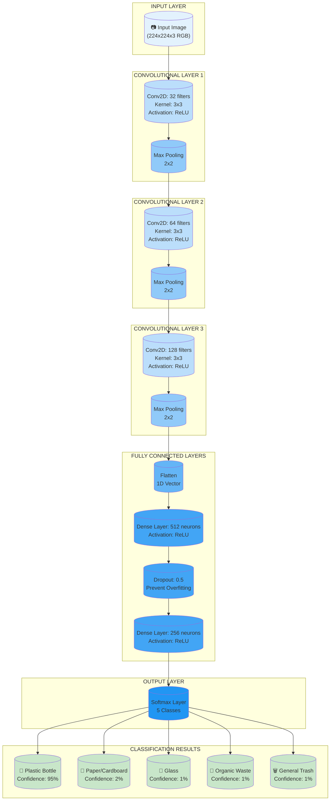
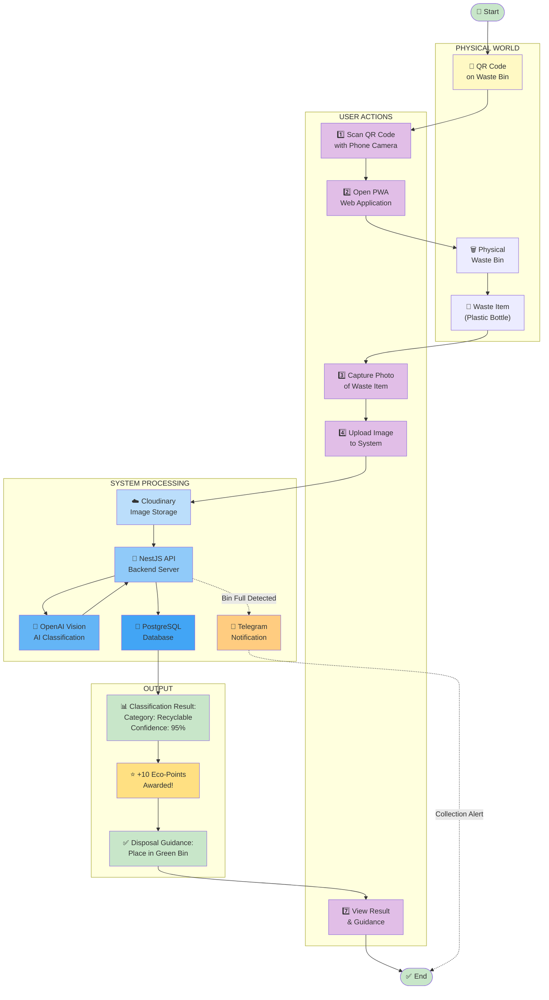
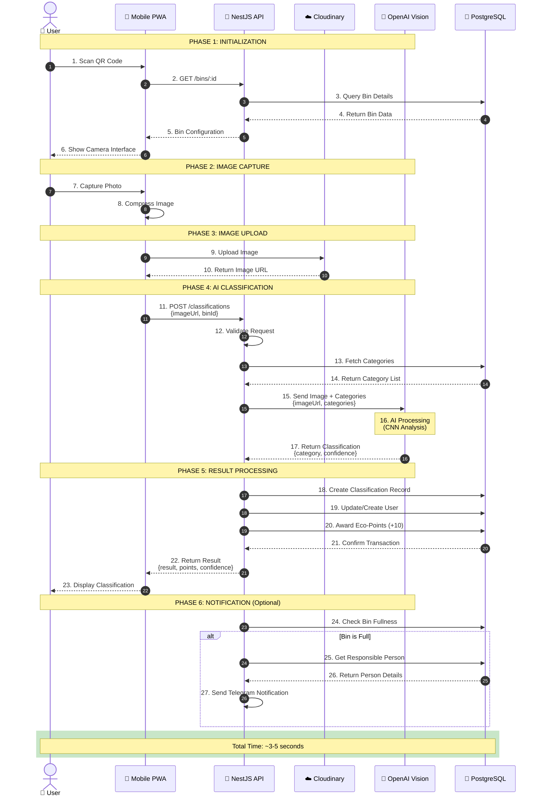
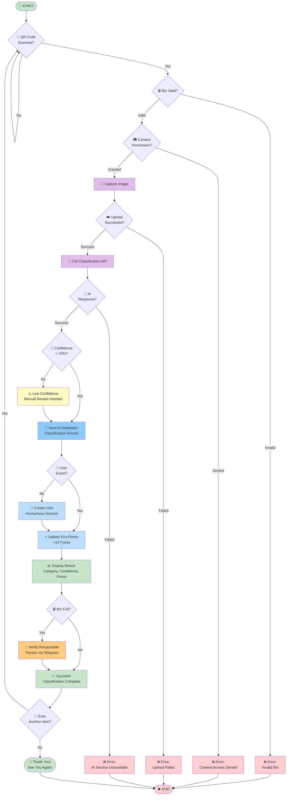
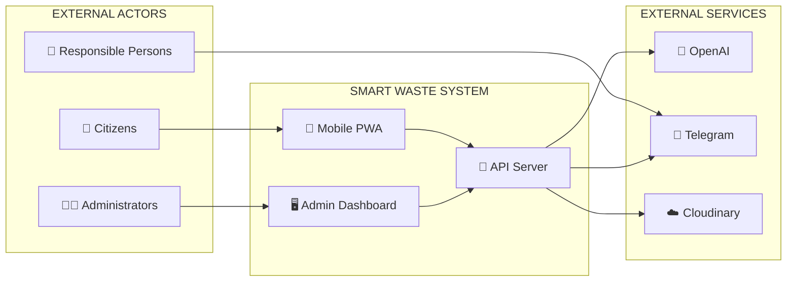
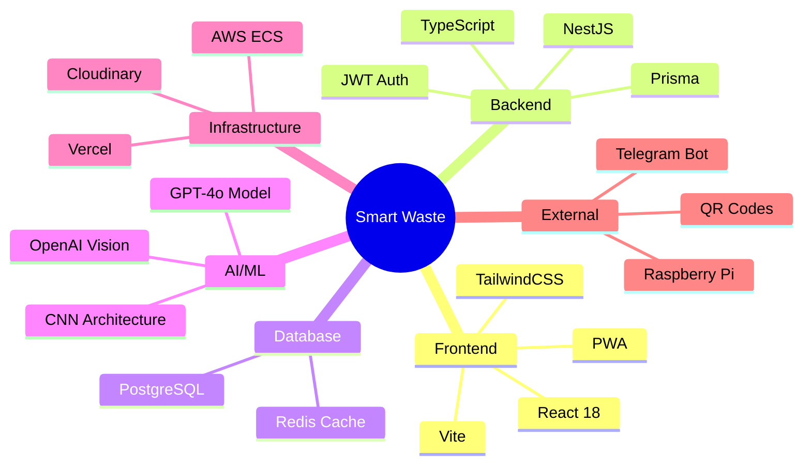

# Smart Waste - Flows and Diagrams

## Diploma Thesis Visual Documentation

**Author:** Ernur Torekul
**Project:** Intelligent Household Waste Classification System
**Document Version:** 1.0
**Last Updated:** 2026-04-08

---

## Table of Contents

1. [Figure 1.2 - CNN Working Principle](#figure-12---convolutional-neural-network-cnn-working-principle)
2. [Figure 1.3 - User-System Interaction Scheme](#figure-13---user-system-interaction-scheme)
3. [Figure 2.3 - Image Classification Sequence Diagram](#figure-23---image-classification-process-sequence-diagram)
4. [Figure 2.4 - System Operation Algorithmic Flowchart](#figure-24---system-operation-algorithmic-flowchart)

---

## Figure 1.2 - Convolutional Neural Network (CNN) Working Principle

### Description
This diagram illustrates the architecture and working principle of a Convolutional Neural Network (CNN) used for waste image classification. The CNN processes input images through multiple layers to identify waste categories (plastic, paper, glass, organic, etc.).

### Figure Title (Kazakh): Сурет 1.2. Конволюциялық нейрондық желінің (CNN) жұмыс істеу принципі

### Figure Title (Russian): Рисунок 1.2. Принцип работы сверточной нейронной сети (CNN)

### Mermaid Diagram



### Technical Explanation

**Convolutional Layers:** Extract features from the input image using learnable filters. Each filter detects specific patterns (edges, textures, shapes).

**Pooling Layers:** Reduce spatial dimensions while preserving important features, making the network more computationally efficient.

**Fully Connected Layers:** Interpret the extracted features and make the final classification decision.

**Softmax Output:** Produces probability distribution across all waste categories, with the highest probability indicating the predicted class.

### Export Instructions
To export as PNG/SVG:
1. Visit https://mermaid.live
2. Paste the Mermaid code above
3. Click "Download PNG" or "Download SVG"

---

## Figure 1.3 - User-System Interaction Scheme

### Description
This block diagram illustrates the complete user flow and interaction points between the user and the Smart Waste system, from QR code scanning to final classification result display.

### Figure Title (Kazakh): Сурет 1.3. Пайдаланушы мен жүйенің өзара әрекеттесу схемасы

### Figure Title (Russian): Рисунок 1.3. Схема взаимодействия пользователя и системы

### Mermaid Diagram



### User Journey Steps

| Step | Action | System Response |
|------|--------|-----------------|
| 1 | User scans QR code on waste bin | Opens mobile PWA with bin ID |
| 2 | Application loads | Requests camera permission |
| 3 | User captures photo of waste item | Image uploaded to Cloudinary |
| 4 | System processes image | Sends to OpenAI Vision API |
| 5 | AI analyzes image | Returns classification result |
| 6 | System stores result | Saves to database, awards points |
| 7 | User views result | Displays category, confidence, guidance |

### Export Instructions
To export as PNG/SVG:
1. Visit https://mermaid.live
2. Paste the Mermaid code above
3. Click "Download PNG" or "Download SVG"

---

## Figure 2.3 - Image Classification Process Sequence Diagram

### Description
This sequence diagram illustrates the time-ordered data exchange between all system components during the image classification process, showing the complete request-response lifecycle.

### Figure Title (Kazakh): Сурет 2.3. Кескінді жіктеу процесінің реттілік диаграммасы

### Figure Title (Russian): Рисунок 2.3. Диаграмма последовательности процесса классификации изображений

### Mermaid Diagram



### Timeline Breakdown

| Phase | Duration | Description |
|-------|----------|-------------|
| Initialization | ~500ms | QR scan, bin verification |
| Image Capture | ~200ms | Photo capture and compression |
| Image Upload | ~1000ms | Upload to Cloudinary CDN |
| AI Classification | ~2000ms | OpenAI Vision API processing |
| Result Processing | ~300ms | Database operations |
| **Total** | **~4 seconds** | End-to-end classification time |

### Data Flow Summary

```
User Input → QR Code → PWA → Cloudinary → API → OpenAI → API → DB → API → PWA → User Output
```

### Export Instructions
To export as PNG/SVG:
1. Visit https://mermaid.live
2. Paste the Mermaid code above
3. Click "Download PNG" or "Download SVG"

---

## Figure 2.4 - System Operation Algorithmic Flowchart

### Description
This algorithmic flowchart presents the complete program logic of the Smart Waste system, showing all decision points, processes, and possible execution paths from start to finish.

### Figure Title (Kazakh): Сурет 2.4. Жүйе жұмысының алгоритмдік блок-схемасы

### Figure Title (Russian): Рисунок 2.4. Алгоритмическая блок-схема работы системы

### Mermaid Diagram



### Algorithm Steps (Pseudocode)

```
BEGIN
    WHILE user wants to scan
        IF QR code is valid
            IF camera permission granted
                CAPTURE image
                IF upload successful
                    CALL classification API
                    IF AI responds successfully
                        IF confidence > 70%
                            SAVE classification to database
                            IF user exists
                                UPDATE eco-points (+10)
                            ELSE
                                CREATE new user
                                UPDATE eco-points (+10)
                            END IF
                            DISPLAY result to user
                            IF bin is full
                                NOTIFY responsible person
                            END IF
                        ELSE
                            DISPLAY low confidence warning
                            MARK for manual review
                        END IF
                    ELSE
                        DISPLAY AI service error
                    END IF
                ELSE
                    DISPLAY upload error
                END IF
            ELSE
                DISPLAY camera permission error
            END IF
        ELSE
            DISPLAY invalid bin error
        END IF
        ASK if user wants to scan another item
    END WHILE
    DISPLAY goodbye message
END
```

### Decision Points

| Decision | Condition | Action |
|----------|-----------|--------|
| QR Code Scanned? | Valid QR code detected | Proceed to bin validation |
| Bin Valid? | Bin exists in database | Request camera permission |
| Camera Permission? | User granted access | Capture image |
| Upload Successful? | Image uploaded to Cloudinary | Call API |
| AI Response? | OpenAI returns result | Check confidence |
| Confidence > 70%? | High confidence result | Save to database |
| User Exists? | Telegram ID in database | Update points |
| Bin Full? | Fullness status true | Send notification |
| Scan Another? | User wants to continue | Restart loop |

### Export Instructions
To export as PNG/SVG:
1. Visit https://mermaid.live
2. Paste the Mermaid code above
3. Click "Download PNG" or "Download SVG"

---

## Additional Reference Diagrams

### System Context Diagram



### Technology Stack Overview



---

## Export Guide for All Diagrams

### Method 1: Mermaid Live Editor (Recommended)

1. Go to https://mermaid.live
2. Copy the Mermaid code block from any diagram above
3. Paste into the left panel
4. The diagram renders automatically
5. Click "Download PNG" or "Download SVG"

### Method 2: VS Code Extension

1. Install VS Code
2. Install "Markdown Preview Mermaid Support" extension
3. Open this file in VS Code
4. Open preview (Cmd/Ctrl + Shift + V)
5. Right-click on diagram → "Copy as PNG"

### Method 3: Command Line (mermaid-cli)

```bash
# Install mermaid-cli
npm install -g @mermaid-js/mermaid-cli

# Export diagram
mmdc -i input.mmd -o output.png
```

### Method 4: Online Tools

- **Draw.io:** Import Mermaid code
- **Mermaid Chart:** https://www.mermaidchart.com
- **Mermaid Live:** https://mermaid.live

---

## Figure Placement in Thesis

### Recommended Placement

| Figure | Section | Page Suggestion |
|--------|---------|-----------------|
| Figure 1.2 (CNN) | 1.2 - AI Recognition Process | Page 8-10 |
| Figure 1.3 (User Flow) | 1.3 - Logical Schema | Page 12-14 |
| Figure 2.3 (Sequence) | 2.3 - Implementation Details | Page 25-27 |
| Figure 2.4 (Algorithm) | 2.3 - Implementation Details | Page 28-30 |

### Caption Format

```
Figure 1.2. Convolutional Neural Network (CNN) working principle.
Source: Developed by author based on OpenAI GPT-4o architecture.
```

---

## Document Information

**Total Figures:** 4 main diagrams + 2 reference diagrams
**Format:** Mermaid (exportable to PNG/SVG)
**Resolution:** Scalable vector graphics (SVG) recommended for thesis
**Color Scheme:** Professional academic colors
**Fonts:** Sans-serif (automatically rendered)

**Tips for Thesis:**
1. Export all diagrams as high-resolution PNG (300 DPI)
2. Keep consistent styling across all figures
3. Add figure numbers and captions in your document processor
4. Reference each figure in the text before it appears
5. Consider creating grayscale versions for print

---

**Document Version:** 1.0
**Last Updated:** 2026-04-08
**Author:** Ernur Torekul
**Purpose:** Diploma Thesis Visual Documentation
